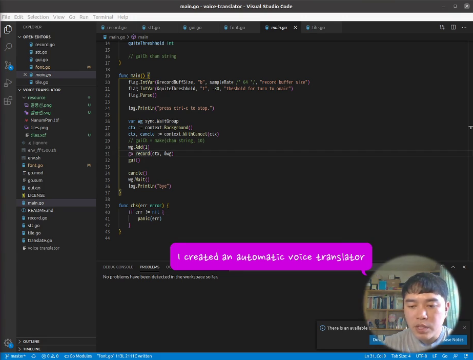

# horseballoon

* [개인방송](https://twitch.tv/suapapa)에서 사용하고 있는 한-영 음성 자동 변환 **말풍선** 프로그램.
* This is a program to make English text bubble from Korean speech in real time.
* [Introduction video](https://youtu.be/eFf7GtkCA1M)

# build and run

Install dependency:

    $ apt install portaudio19-dev # Linux

    $ brew install portaudio # Mac

Clone and build:

    $ git clone https://github.com/suapapa/horseballoon
    $ go build

Fill your `API_KEY` of [kakao developers](https://developers.kakao.com/) to `env.sh`:

    $ source ./env.sh
    $ ./horseballoon
